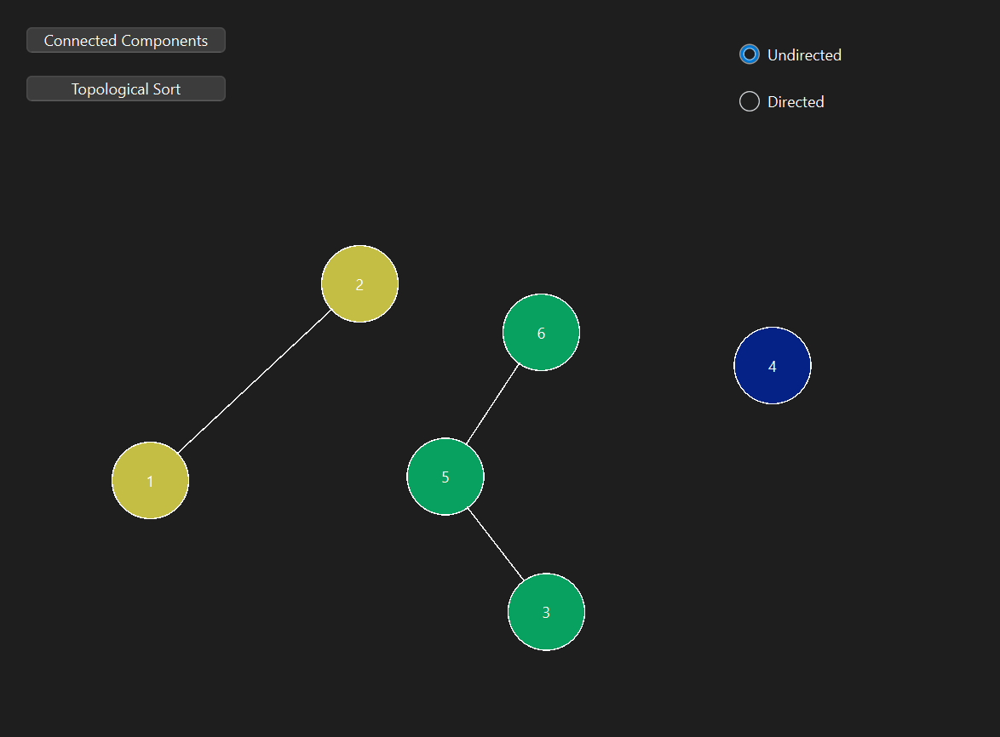

# Topological Sort and Connected Components Graph Visualizer

## Overview

This is a Qt-based C++ application that allows users to interactively create, visualize, and analyze graphs. It supports functionalities such as:

- Adding and connecting nodes dynamically.
- Visualizing connected components of an undirected graph.
- Performing topological sorting on directed graphs.
- Dragging nodes to rearrange the graph layout.

## Features

- **Interactive Graph Construction:** Click to add nodes and edges.
- **Connected Components Visualization:** Detects and highlights connected components using different colors.

- **Topological Sorting:** Performs a topological sort on directed graphs and displays the sorted order.
- **Drag and Drop:** Move nodes around for better visualization.
- **Directed and Undirected Graph Modes:** Switch between graph types.

### Prerequisites

- Qt Creator installed.
